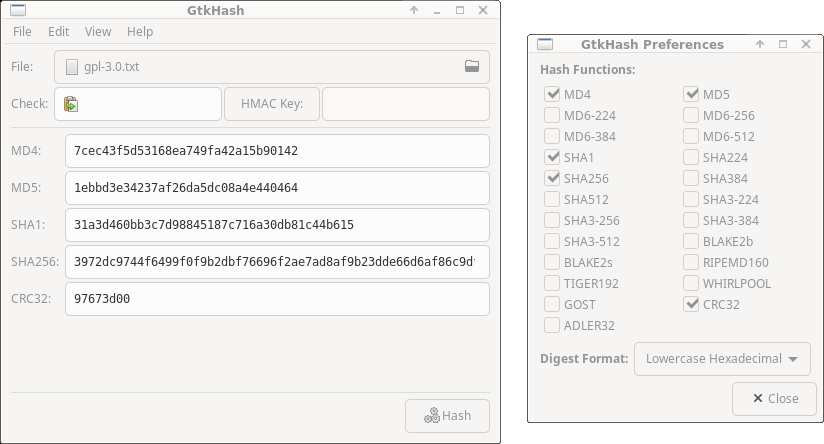
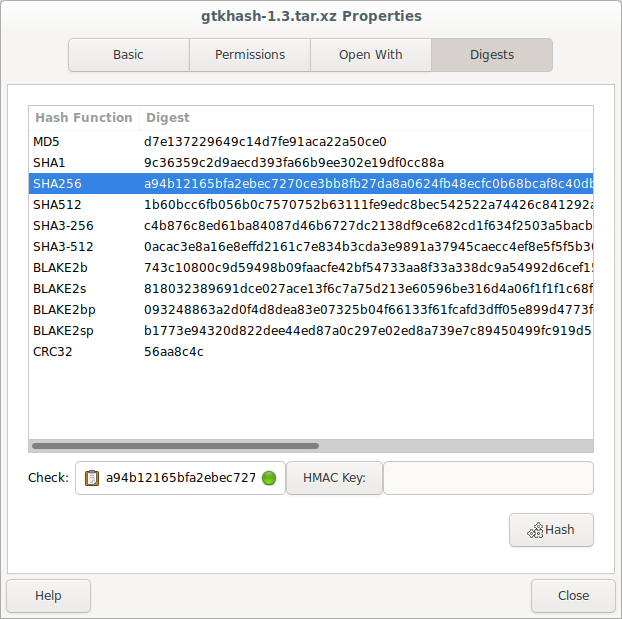

GtkHash
=======

GtkHash is a desktop utility for computing message digests or checksums.
Most well-known hash functions are supported, including MD5, SHA1,
SHA2 (SHA256/SHA512), SHA3 and BLAKE2.

It's designed to be an easy to use, graphical alternative to command-line
tools such as md5sum.

Features:
* Support for verifying checksum files from sfv, sha256sum, etc.
* Keyed hashing (HMAC)
* Parallel/multi-threaded hash calculation
* Remote file access using GIO/GVfs
* File manager integration
* Small and fast

GtkHash is free software: you can redistribute it and/or modify it under the
terms of the GNU General Public License as published by the Free Software
Foundation, either version 2 of the License, or (at your option) any later
version.

Required Dependencies
-------------
* GTK 3.18
* GLib 2.48

Optional Dependencies
---------------------
* Libgcrypt (default)
* libb2 (default)
* Nettle
* OpenSSL
* mbed TLS
* Linux kernel AF_ALG

See `./configure --help` for the full list of build options.

File Manager Extension
-----------------------

Adds a Hash feature to File Properties in:
* Caja (MATE)
* Nautilus (GNOME)
* Nemo (Cinnamon)
* Thunar (Xfce)

Translations
------------

If you would like to contribute a translation, the easiest way is by using
Weblate:

https://hosted.weblate.org/engage/gtkhash/

Alternatively, updated .po files can be submitted as a Pull Request or Issue on
GitHub:

https://github.com/gtkhash/gtkhash
